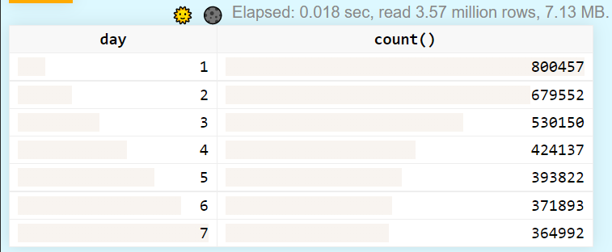

# Lab 8

## Установка ClickHouse
    sudo apt-get install apt-transport-https ca-certificates dirmngr
    sudo apt-key adv --keyserver hkp://keyserver.ubuntu.com:80 --recv E0C56BD4

    echo "deb https://repo.clickhouse.com/deb/stable/ main/" | sudo tee \
    /etc/apt/sources.list.d/clickhouse.list
    sudo apt-get update

    # Попросит установить пароль -- просто нажать Enter для пустого пароля
    sudo apt-get install -y clickhouse-server clickhouse-client
    
    sudo service clickhouse-server start
    clickhouse-client

## Перенос данных
Запуск скрипта для экспорта данных из tarantool (запускать из директории, где создавалась БД, в двнном случае из `lab7`):

    cd lab7
    tarantool ../lab8/dump_data.lua

В результате будут получены 7 файлов в директории `lab7` с назвниями 'dayX.csv'.

Запуск скрипта для импорта данных в ClickHouse:

    cd ../lab8
    ./insert_to_clickhouse.sh

## Проверка
Чтобы проверить, что данные успешно загружены, можно вывести количество строк для каждого дня в веб-интерфейсе

http://localhost:8123/play
    
    select day, count(*) from lab8.userlog group by day;

Результат:

